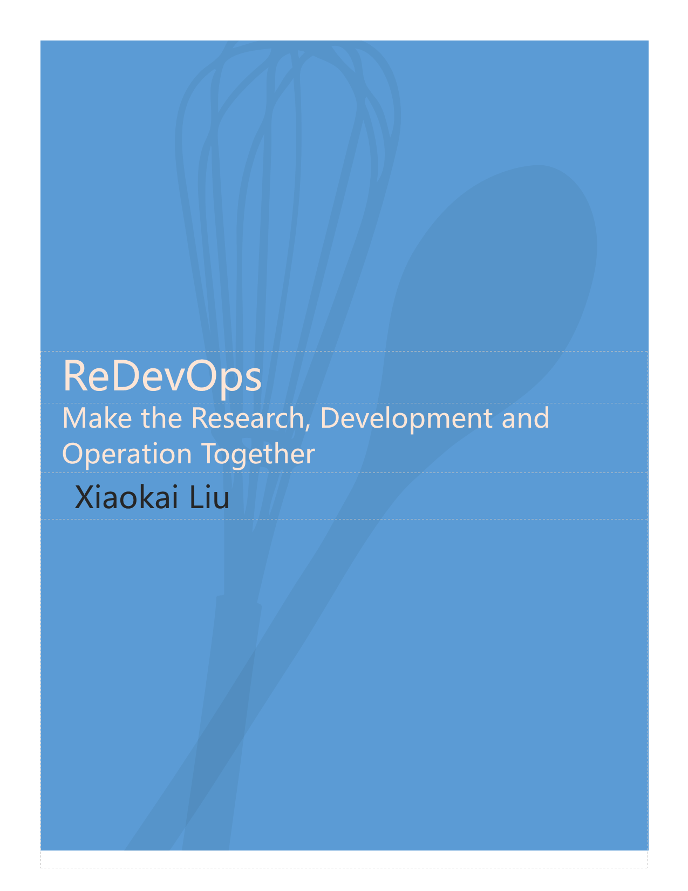

# Introduction

Welcome to the homepage of Johannes's Gitbook. The of Johannes' Gitbook aims to share the knowledge and experience he has accumulated in his work and research.

Currently, Johannes is striving to write a book named "[ReDevOps - Make the Research, Development and Operation Together](https://johannesliu.gitbook.io/redevops)". It's about a book that discusses how to transfer the knowledge of DevOps to Research works. 

In the past, Johannes has finished 3 books, They are:

(1) [Data Science - Python Implemented](https://johannesliu.gitbook.io/learning-advanced-mathematics-with-python)  
(2) [Learning Advanced Mathematics using Python](https://johannesliu.gitbook.io/learning-advanced-mathematics-with-python)  
(3) [Knowledge Extraction (To be uploaded)](https://johannesliu.gitbook.io/knowledge-extraction-concept-and-technology)

The Books Wrote by Johannes Liu

You are welcome to read them and comments on them.